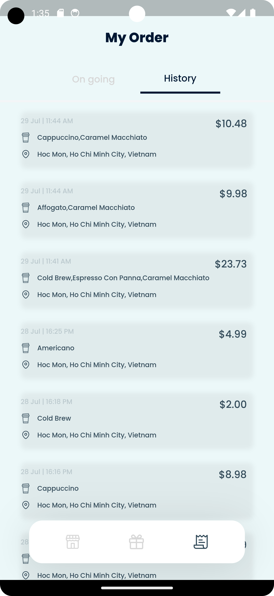

## ORDINARY COFFEE HOUSE

This is a midterm product for the course Mobile Device Application Development - CS426
at the University of Sciences, VNU-HCM, Vietnam.

# Brief view

This application is UI based on this: [Design](https://www.figma.com/file/DwWheBUCT8TKlhjdwMkDQ8/CS426?mode=dev)
Although it is an Android course, our instructor encourage us to try many different frameworks.
Therefore, this project is built upon Flutter, a framework of Dart.

# View of the application

  

  

  

 

# How to run

You can either:

1. Clone this repository.
2. Open the project in Android Studio.
3. Run `flutter pub get` in the terminal.
4. Run `flutter run` in the terminal.

or:

1. Download the apk file in the build/app/outputs/flutter-apk folder.
2. Install it on your Android device or run it in Android Studio.

# Interesting features

1. Using BLoCs to manage internal state and Data Repository to store data and interact with BloCs.
2. Applying 3-tiers architecture in managing states between widgets
3. Firebase Firestore for storing users and system information.
4. Firebase Authentication for authenticating users.

# Extra Requirements

1. End-users must be authenticated, including login and sign up, to use this application.
2. Accounts’ information will be preserved in cloud storage.
3. Users log in and log out without worrying about losing their progress and history information.

# Extra Features

1. Provide each coffee product a description.
2. Hide the bottom navigation bar when scrolling down.
3. The cold drink has more customizable options than the hot one.
4. Provide various kinds of vouchers: DrinkReward (to exchange for free drink), DiscountVoucher and FreeshipVoucher in the redeem reward section.
5. Showing a list of free drinks when owner account has at least one of those DrinkRewards he exchanged as a form of a carousel in HomeView:
    a. DrinkReward can be presented as FreeCoffeeProduct in Order Details, the rule is you can customize whatever you want but the number of drinks must always be 1.
    b. You can order multiple order items and use drink rewards to exchange drinks in the same cart. Any drink rewards that are currently in an unpaid cart will not be in the carousel list mentioned above.
6. If the owner has discount or / and free ship vouchers, in the order cart view, we will:
    a. Render list of order items with their prices, free drink is $0.00.
    b. Automatically identify the best voucher option for discount as well as use free ship voucher if exists. Apply them to the price of the current cart.
    c. If a cart has only DrinkRedeem drink exchange, DiscountVoucher will not be appplied, however FreeshipVoucher still.
7. Each change to the user data will be considered as a transaction to not losing information between multiple devices trying to access the account at the same time.
8. Authentication flow is integrated into the application:
    a. If you have an account, you can use email – password strategy to use this application.
    b. If not, you can use an default account (an account which I use to develop) to continue.
    c. If you want to sign up, you can use email – password strategy to create a new account.
    d. If you want to sign out, you can use the sign out button in the profile page.

# References

- Dependency:
    1. flutter_svg: ^2.0.7
    2. flutter_bloc: ^8.1.3
    3. flow_builder: ^0.0.9
    4. const_date_time: ^1.0.2
    5. provider: ^6.0.5
    6. equatable: ^2.0.5
    7. uuid: ^3.0.7
    8. flutter_slidable: ^3.0.0
    9. carousel_slider: ^4.2.1
    10. firebase_core: ^2.15.0
    11. cloud_firestore: ^4.8.3
    12. json_annotation: ^4.8.1
    13. firebase_auth: ^4.7.2

- Dev Dependency:
    1. build_runner: ^2.4.6
    2. json_serializable: ^6.7.1

- Assets:
    1. All the images I used in this project were taken from this website.
    2. Poppins and DM Sans font are taken from Google Fonts.

- Architecture Idea:

    1. The 3-tiers architecture using BLoCs is proposed by Bloc official website.
    2. Cloud Storage for Firebase Firestore is documented at this website.
    3. Authentication Handling using Firebase Authentication is proposed by this project.
    4. Using transaction when interact with Firestore is introduced by Using Firestore as a backend to your Flutter app.
